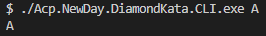
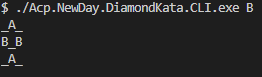
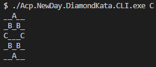
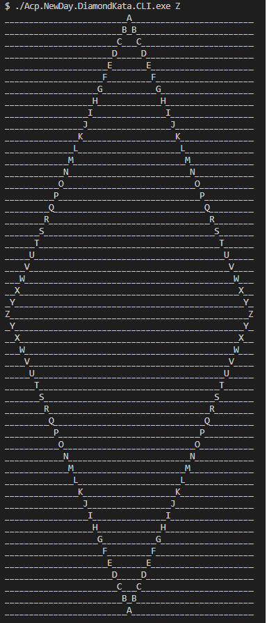
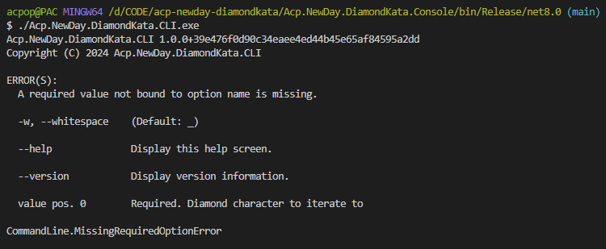
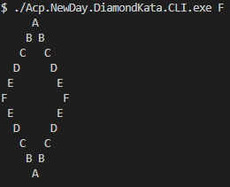
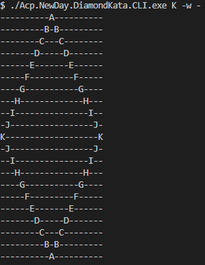

# acp-newday-diamondkata

See [the diamond kata](https://github.com/NewDayTechnology/RecruitmentTests/blob/main/DiamondKata/README.md).

Screenshots below.

> basic test s







> z test



> no command line parameters errors caught

 

> specify whitespace characters

```sh
./Acp.NewDay.DiamondKata.CLI.exe K -w -
./Acp.NewDay.DiamondKata.CLI.exe K --whitespace -
```





